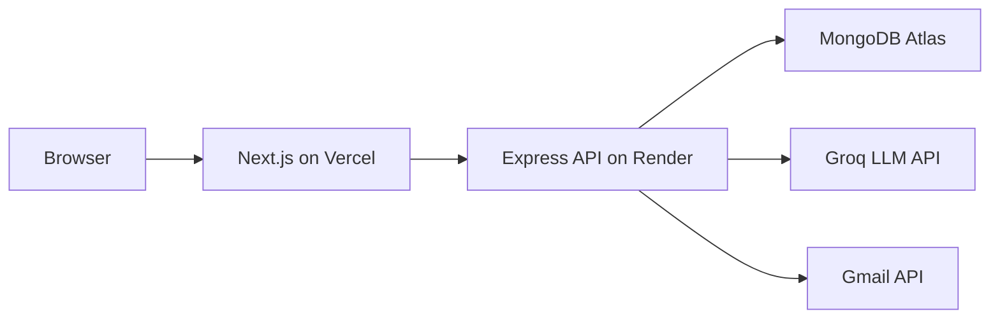

# PrepPilot


AI-powered internship prep: text mock interviews, live AI interviews, aptitude tests, job search, and Gmail applications.

## Architecture



The frontend signs users in via NextAuth, mints a short-lived JWT, and
attaches it as a bearer token on every backend request. The backend verifies
that token and checks it against any `:userId` in the request — see
**Security** below.

## Local development

### Prerequisites
- Node.js 18+
- MongoDB (Atlas or local)

### 1. Backend (port 5000)
```powershell
cd backend
npm install
copy .env.example .env
# Fill MONGODB_URI, GROQ_API_KEY, GOOGLE_* in .env
# NEXTAUTH_SECRET must match the frontend's value exactly (see Security below)
npm run dev
```

### 2. Frontend (port 3000)
```powershell
cd frontend
npm install
copy .env.example .env.local
# Fill NEXT_PUBLIC_API_URL, NEXTAUTH_*, GOOGLE_* in .env.local
npm run dev
```

Open http://localhost:3000

### 3. Seed aptitude questions (optional)
```powershell
node execution/seed_aptitude_questions.js
```

## Testing

```powershell
cd backend
npm test          # Jest: auth middleware (401/403/200 cases) + code-execution helpers
npm run smoke      # sanity check that every route module still loads
```

Frontend tests aren't set up yet — this is a known gap, not an oversight.

## Deployment

| Service | Platform |
|---------|----------|
| Frontend | Vercel (`frontend/`) |
| Backend | Render (`render.yaml`) |
| Database | MongoDB Atlas |

Render's free tier spins down after ~15 min idle, costing the next request a
~50s cold start. `.github/workflows/keep-warm.yml` pings the health check
(`GET /`) every 10 minutes to prevent that — set a `BACKEND_URL` repo secret
to your Render URL, or use a free external cron (e.g. [cron-job.org](https://cron-job.org)) as a more reliable backup.

## Security

Every backend route that returns or modifies a specific user's data requires
a valid bearer token (`backend/middleware/auth.js`), and any `:userId` in the
URL is checked against the authenticated user — a mismatch is rejected with
403, not just 401. Covered end-to-end by `backend/middleware/auth.test.js`.

## Features

- **AI Interview** — practice with feedback, or live behavioral/technical interviews (`/interview`)
- **Aptitude tests** — quant/logical/verbal (`/aptitude`)
- **Job search** — scrape + cover letter + Gmail (`/dashboard`, `/upload`)
- **Profile** — stats and interview/aptitude history (`/profile`)
