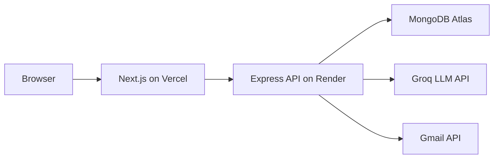

# PrepPilot
AI-powered internship prep: text mock interviews, live AI interviews, aptitude tests, job search.

## Architecture



## Local development


### 1. Backend (port 5000)
```powershell
cd backend
npm install
copy .env.example .env
# Fill MONGODB_URI, GROQ_API_KEY, GOOGLE_* in .env
# NEXTAUTH_SECRET must match the frontend's value exactly (see Security below)
npm run dev
```

### 2. Frontend (port 3000)
```powershell
cd frontend
npm install
copy .env.example .env.local
# Fill NEXT_PUBLIC_API_URL, NEXTAUTH_*, GOOGLE_* in .env.local
npm run dev
```

Open http://localhost:3000

### 3. Seed aptitude questions (optional)
```powershell
node execution/seed_aptitude_questions.js
```

## Testing

```powershell
cd backend
npm test          # Jest: auth middleware (401/403/200 cases) + code-execution helpers
npm run smoke      # sanity check that every route module still loads
```

Frontend tests aren't set up yet — this is a known gap, not an oversight.

## Features

- **AI Interview** — practice with feedback, or live behavioral/technical interviews (`/interview`)
- **Aptitude tests** — quant/logical/verbal (`/aptitude`)
- **Job search** — scrape + cover letter + Gmail (`/dashboard`, `/upload`)
- **Profile** — stats and interview/aptitude history (`/profile`)
